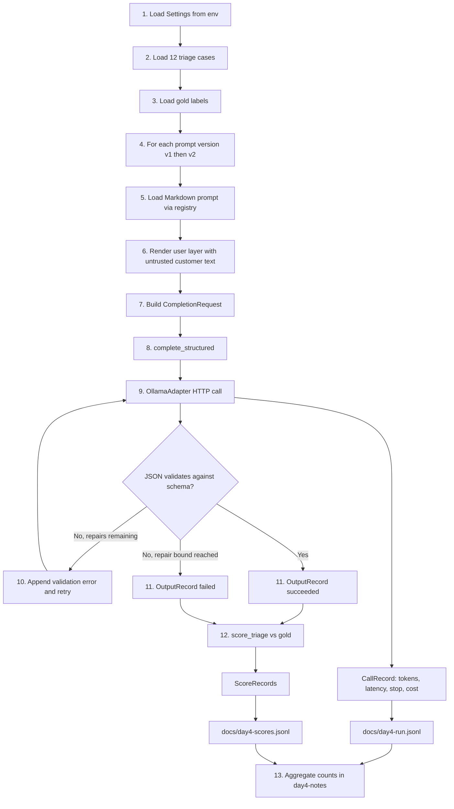

# Week 2 Prompt Lab: files, schemas, and flow

This repository is a local Ollama prompt-engineering lab. Each day adds one layer. Day 4 is the full pipeline: cases go through a versioned prompt, a structured model call, deterministic scoring, and committed metrics.

Models run on the host through Ollama (`mistral:7b` or `qwen3:8b`). Python runs in the devcontainer and talks to `http://host.docker.internal:11434`. Local provider/API cost is always `$0.00`; tokens and latency are still measured.

## How the four days fit together

| Day | What you add | Task | Evidence |
| --- | --- | --- | --- |
| 1 | Instrument a real model call and persist a usage record | extraction (3 cases) | `docs/day1-run.jsonl`, `docs/day1-observations.md` |
| 2 | Adapter contract; same prompt, two models | summarization (12 cases) | `docs/day2-run.jsonl`, `docs/day2-comparison.md` |
| 3 | Schema-validated JSON plus a bounded repair loop | summarization + extraction | `docs/day3-run.jsonl`, `docs/day3-notes.md` |
| 4 | Prompt registry, two triage prompts, gold scoring | triage v1 vs v2 (12 cases) | `docs/day4-run.jsonl`, `docs/day4-scores.jsonl`, `docs/day4-notes.md` |

Shared results across days live in `docs/notes.md`. Assignment instructions for Day 4 live in `docs/w02-04-assignment/`. Day 1 instructions live in `assignments/W02_Day1_Assignment_LOCAL.md`.

---

## End-to-end flowchart

The diagram below is the mature (Day 4) path. Days 1–3 built the pieces this path uses: usage records, the adapter, structured completion, and schemas.

In one sentence: **case text in → versioned prompt → Ollama → schema check (optional repair) → usage + output records → compare with gold → score metrics.**

---

## Project flow in simple terms

1. **Configure.** `Settings.from_env()` supplies the Ollama URL, logical model names (`mistral`, `qwen`), temperature, retry bound, and schema-repair bound.
2. **Load cases.** Each JSONL row has `id`, `task`, and `source` (the untrusted document or customer message).
3. **Load gold (Day 4).** Expected queue and expected escalation for each case id. Scoring never calls a model.
4. **Select prompt.** `prompts.load("triage", "v1")` or `"v2"` reads `src/prompts/triage.v1.md` / `triage.v2.md` and splits `## System` / `## User`.
5. **Render safely.** `render_user` fills `{document_text}` with customer text after neutralizing marker-closing sequences. Missing placeholders raise; they are not replaced with empty strings.
6. **Request.** A `CompletionRequest` carries task, case id, prompt id/version, system text, rendered user text, temperature `0.0`, and `max_output_tokens` `512`.
7. **Structured complete.** `complete_structured` sends the request through `ModelAdapter` → `OllamaAdapter`. Transport retries stay in the adapter. Schema/content repair stays here.
8. **Validate.** Parse JSON (fences allowed) against `TriageOutput` (v1) or `TriageOutputWithAnalysis` (v2). On failure, send the error back once and ask for corrected JSON only.
9. **Record the call.** Every HTTP attempt becomes a `CallRecord` (tokens, latency, stop reason, `$0.00`). Successful or failed structured results become an `OutputRecord`.
10. **Score.** `score_triage` compares predicted `queue` and `escalation_required` with gold, splits missed vs unnecessary escalation, and checks `draft_reply` / `customer_outcome` against boundary-language patterns in `config.py`.
11. **Collect metrics.** Scores append as `ScoreRecord` rows. Day 4 copies usage to `docs/day4-run.jsonl` and scores to `docs/day4-scores.jsonl`. Notes report counts with denominators (for example `7/12`), plus token and latency overhead.

Day 1 skipped the adapter and schemas and wrote usage records from a direct HTTP call. Day 2 added the adapter and compared two models on the same prompt. Day 3 added schema validation and repair for summarization and extraction. Day 4 reuses that stack for a controlled **prompt-version** experiment on one model.

---

## Relevant files

Grouped by role in the flow, not by directory listing.

### Cases and gold labels

| File | Contains | Purpose in the flow |
| --- | --- | --- |
| `cases/triage.jsonl` | 12 customer messages (`T01`–`T12`) with `id`, `task`, `source` | Day 4 inputs. Includes mixed-work, unsupported, prompt-injection, and PII cases. |
| `cases/gold/triage.jsonl` | `expected_queue` and `expected_escalation` per case | Day 4 scoring labels. Escalation gold is this field, not `human_review_required`. |
| `cases/extraction.jsonl` | 12 KYC policy documents (`E01`–`E12`) | Day 1 (E12, E07, E11) and Day 3 extraction. |
| `cases/summarization.jsonl` | 12 procedure documents (`S01`–`S12`) | Day 2 model comparison and Day 3 summarization. |
| `cases/gold/extraction.jsonl` | Expected document status and recoverable fields | Reference labels for extraction quality notes. |
| `cases/gold/summarization.jsonl` | Expected document status and recoverable fields | Reference labels for summarization quality notes. |

### Prompt files (`src/prompts/`) vs registry (`src/promptlab/prompts.py`)

These are different things. Markdown templates live under `src/prompts/`. Python loading/rendering lives in `src/promptlab/prompts.py`.

| File | Contains | Purpose in the flow |
| --- | --- | --- |
| `src/promptlab/prompts.py` | `PromptTemplate`, `load`, `render_user`, `MissingPromptVariableError` | Central prompt registry. Day 4 must not open Markdown files from other call sites. |
| `src/prompts/baseline.v0.md` | Plain-text extraction/summary instructions plus `{document_text}` | Day 1 and Day 2 starter prompt (not schema JSON). |
| `src/prompts/summarize.v1.md` | Structured summarization instructions | Day 3; validated against `SummarizationOutput`. |
| `src/prompts/extract.v1.md` / `extract.v2.md` | Structured extraction instructions | Day 3 uses v2; validated against `PolicyExtraction`. |
| `src/prompts/triage.v1.md` | Layered system/user triage prompt | Day 4 control. Must validate as `TriageOutput`. Does not request `analysis`. |
| `src/prompts/triage.v2.md` | Same as v1 plus a short `analysis` field | Day 4 experiment. Validated as `TriageOutputWithAnalysis`. One deliberate change. |

### Runtime: config, call site, adapter, structured output

| File | Contains | Purpose in the flow |
| --- | --- | --- |
| `src/promptlab/config.py` | `Settings`, `ModelConfig`, `BOUNDARY_LANGUAGE_PATTERNS`, `PII_PATTERNS` | Model ids, Ollama URL, repair/retry bounds, human-boundary regexes used by scoring. |
| `src/promptlab/errors.py` | `UnknownModelError`, transient/permanent provider errors, `TruncatedResponseError` | Shared error types for usage records and adapter retries. |
| `src/promptlab/usage.py` | `CallRecord`, `compute_cost`, `append_record` | Day 1 contract. Every real model attempt (including retries and repairs) is one append-only JSONL line under `runs/{run_id}.jsonl`. |
| `src/promptlab/adapters/base.py` | `CompletionRequest`, `CompletionResult`, `ModelAdapter` protocol | Shared request vocabulary. `task` is only `triage`, `summarization`, or `extraction`. |
| `src/promptlab/adapters/ollama.py` | HTTP generate call, transport retries, truncation handling | Only place Day 4 talks to Ollama. Maps `prompt_eval_count` / `eval_count` / `done_reason` onto `CallRecord`. |
| `src/promptlab/structured.py` | `complete_structured` | Parse JSON, validate against a Pydantic schema, bounded semantic repair, write `OutputRecord`. |
| `src/promptlab/schemas.py` | Output models and `OUTPUT_SCHEMAS` | Source of truth for what the model must return. See [Schemas](#schemas). |
| `src/promptlab/records.py` | `UsageRecord`, `OutputRecord`, `ScoreRecord` | Later-day record contracts. Day 4 scoring reuses `ScoreRecord`; it does not invent a second format. |
| `src/promptlab/scoring.py` | `score_triage`, `human_boundary_pass` | Deterministic metrics. Does not call Ollama. |
| `src/promptlab/day1.py` | Direct Ollama generate for three extraction cases | First instrumentation; no adapter yet. |
| `src/promptlab/day2.py` | Summarization through `OllamaAdapter` for Mistral and Qwen | Introduces the adapter; still free-text baseline prompt. |
| `src/promptlab/day3.py` | Summarization v1 + extraction v2 through `complete_structured` | Introduces schema validation and repair. |
| `src/promptlab/day4.py` | Shared `run_id`, both triage versions, scoring, docs copy | Orchestrates the full flow above. |
| `scripts/raw_call_example.py` | Minimal Ollama generate | Proves the container can reach the host model before Day 1 work. |

### Evidence and notes

| File | Contains | Purpose in the flow |
| --- | --- | --- |
| `docs/day1-run.jsonl` | Three successful extraction `CallRecord`s | Day 1 committed evidence. |
| `docs/day2-run.jsonl` | Mistral + Qwen summarization usage | Day 2 committed evidence. |
| `docs/day3-run.jsonl` | Structured summarization and extraction usage | Day 3 committed evidence. |
| `docs/day4-run.jsonl` | All Day 4 adapter attempts (primaries and repairs) | Trace tokens/latency back to case, model, and prompt version. |
| `docs/day4-scores.jsonl` | One `ScoreRecord` per metric per case per prompt version | Trace scores to the same identifiers. |
| `docs/day4-notes.md` | Counts with denominators, token/latency comparison, conclusion | Answers whether v2's `analysis` field earned its overhead. |
| `docs/notes.md` | Cross-day summary of runs | Index of `run_id`s and headline metrics. |

`runs/` holds live append-only files during a local run. Committed evidence is the `docs/*-run.jsonl` copies. Do not commit a populated `.env`.

---

## Schemas

All output models inherit `StrictModel` (`extra="forbid"`). Extra keys fail validation and can trigger a repair.

### Task vocabulary

`TaskName` = `"triage"` | `"summarization"` | `"extraction"`.

Day 4 requests use `task="triage"`. Do not introduce `"summarize"` or `"extract"` as task values.

`OUTPUT_SCHEMAS` maps:

- `"triage"` → `TriageOutput`
- `"summarization"` → `SummarizationOutput`
- `"extraction"` → `PolicyExtraction`

Day 4 v2 is an experiment overlay: it validates against `TriageOutputWithAnalysis` instead of the map's default.

### Shared field helper

`EvidenceField` (summarization and extraction only):

| Field | Type | Meaning |
| --- | --- | --- |
| `value` | `str`, `list[str]`, or `null` | Extracted content, or null when absent |
| `status` | `"present"`, `"absent"`, `"ambiguous"` | Whether the source supports the value |
| `citation` | `str` or `null` | Source heading/line when present |

`DocumentStatus` = `"valid"` | `"contradictory"` | `"superseded"` | `"unsupported"`.

### TriageOutput (Day 4 v1, and the base contract)

The shipped downstream contract. Do not replace it with a competing `TriageDecision` model.

| Field | Type | Meaning |
| --- | --- | --- |
| `queue` | one of `card_dispute`, `fraud_report`, `account_servicing`, `lending`, `complaint`, `escalate`, `unsupported` | Routing destination |
| `escalation_required` | `bool` | Scored against gold `expected_escalation` |
| `confidence` | `float` 0.0–1.0 | Model-reported confidence |
| `rationale` | `str` | Short routing reason |
| `draft_reply` | `str` | Draft for a human; inspected for boundary language |
| `human_review_required` | always `true` | Standing rule: a human reviews. Not used as gold escalation. |
| `customer_outcome` | always `null` | The model may not decide a customer outcome |

The human boundary: the component may route, escalate, explain, and draft a reply. It may not send the message, close the case, approve/deny a claim, promise a refund, or state that a final outcome is already decided.

### TriageOutputWithAnalysis (Day 4 v2)

Extends `TriageOutput` with one field:

| Field | Type | Meaning |
| --- | --- | --- |
| `analysis` | `str` | Short extra explanation of the routing decision |

`rationale` stays. v2 does not replace it.

### SummarizationOutput (Day 3)

| Field | Type |
| --- | --- |
| `document_status` | `DocumentStatus` |
| `title`, `version`, `effective_date`, `purpose`, `required_steps`, `exceptions` | `EvidenceField` |

### PolicyExtraction (Day 3)

| Field | Type |
| --- | --- |
| `document_status` | `DocumentStatus` |
| `policy_name`, `version`, `effective_date`, `jurisdictions`, `beneficial_ownership_threshold`, `review_frequency`, `required_documents` | `EvidenceField` |

### Request and record schemas

These are not model-output schemas, but they are the other contracts the flow depends on.

**CompletionRequest** (`adapters/base.py`): `task`, `case_id`, `prompt_id`, `prompt_version`, `system`, `user_content`, `temperature`, `max_output_tokens`.

**CompletionResult**: `succeeded`, `text`, `error_type`, `records` (the `CallRecord`s for that adapter call, including transport retries).

**CallRecord** (`usage.py`) — one model-call attempt:

`record_id`, `run_id`, `timestamp` (UTC), `provider` (`"ollama"`), `model_id`, `task`, `case_id`, `prompt_id`, `prompt_version`, `attempt`, `temperature`, `max_output_tokens`, `input_tokens`, `output_tokens`, `cached_input_tokens`, `latency_ms`, `cost_usd`, `stop_reason`, `error_type`, `response_text`.

**OutputRecord** (`records.py`) — one structured completion outcome per case/prompt:

`run_id`, `task`, `case_id`, `model_name`, `model_id`, `prompt_version`, `succeeded`, `repairs`, `output` (parsed dict or null), `error`.

**ScoreRecord** (`records.py`) — one metric cell:

`run_id`, `task`, `case_id`, `model_name`, `prompt_version`, `scorer_version`, `metric`, `numerator`, `denominator`, `lower_is_better`, `detail`.

Day 4 `score_triage` writes five metrics per case, each with `denominator=1` so aggregates are sums:

| Metric | Numerator meaning | `lower_is_better` |
| --- | --- | --- |
| `queue_accuracy` | 1 if predicted queue matches gold | no |
| `escalation_accuracy` | 1 if `escalation_required` matches gold | no |
| `missed_escalation` | 1 if gold required escalation and the model did not | yes |
| `unnecessary_escalation` | 1 if the model escalated and gold did not | yes |
| `human_boundary` | 1 if `draft_reply` and `customer_outcome` have no forbidden outcome language | no |

Gold triage rows (`cases/gold/triage.jsonl`): `id`, `task`, `expected_queue`, `expected_escalation`, optional `metadata` (for example `pii_in_source`).

---

## Controlled Day 4 experiment (what is held constant)

The variable being tested is **prompt version**. Everything else is fixed:

- one configured model (`mistral:7b` in the recorded run)
- temperature `0.0`
- `max_output_tokens` `512`
- the same 12 rows in `cases/triage.jsonl`
- one shared `run_id`
- path: `complete_structured` → `ModelAdapter` → `OllamaAdapter` (no extra Ollama HTTP in Day 4 code)

The question in `docs/day4-notes.md`: did the extra `analysis` field improve routing enough to justify the extra output tokens and latency?
